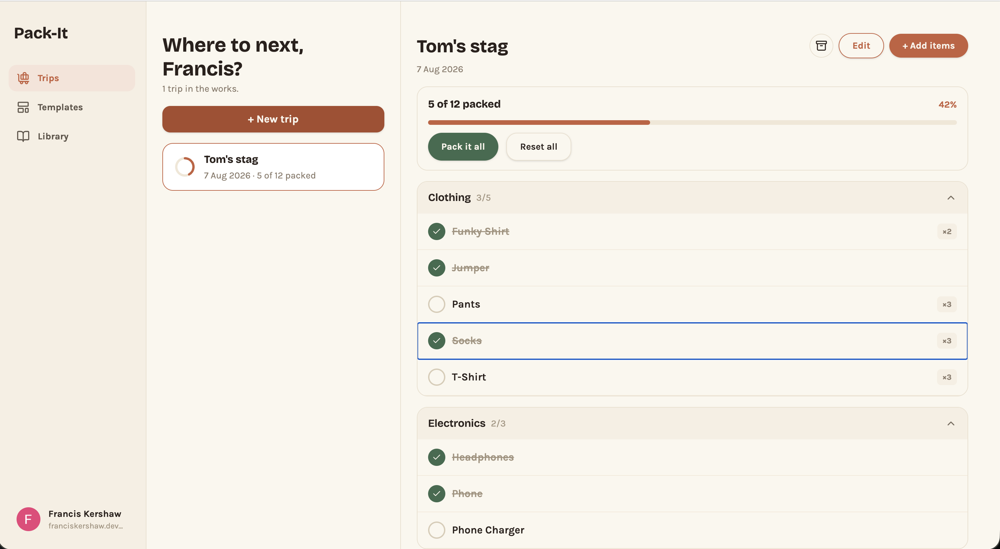
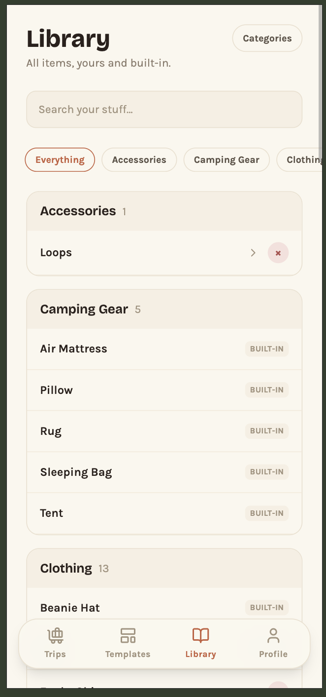
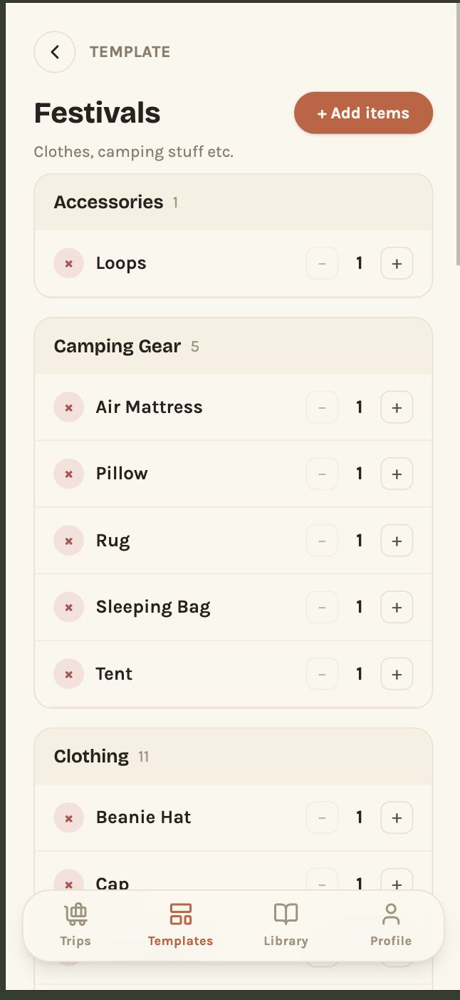
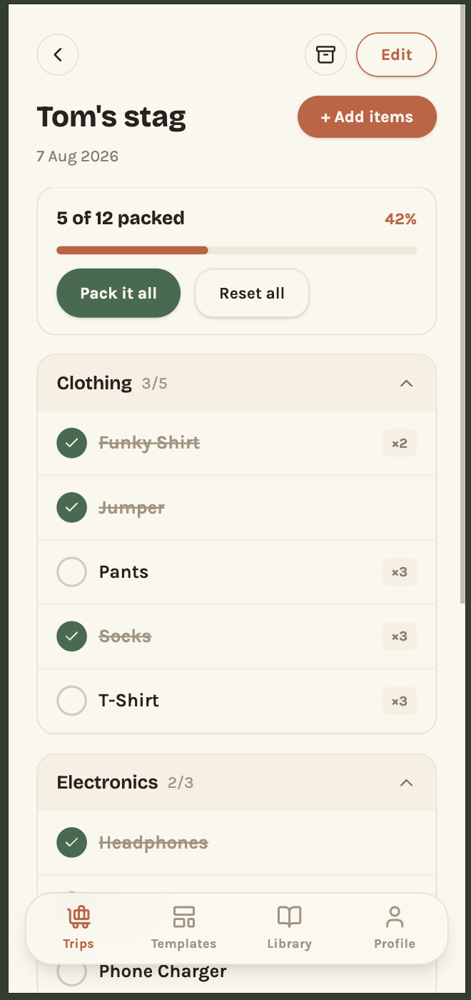

# Packing List - Frontend

Pack-It is a simple full stack application that helps me manage how I pack for trips. I was looking for a small and understandable problem to solve in my day-to-day life that would ultimately allow me to build a project in Go, which was a recently learnt language at the time that I wanted practice in. The live app allows me to now save trips and items that are frequently used so I no longer have to strain my brain every time I pack for a festival. This repo is for the frontend code, in a framework I'm already far more familiar with, with the API code living [here](https://github.com/franciskershaw/packing-list-go).

The site is live and can be accessed with a Gmail account [here](https://packitapp.co.uk).



## Table of Contents

- [Overview](#overview)
- [Screenshots](#screenshots)
- [Tech Stack](#tech-stack)
- [Getting Started](#getting-started)
- [Environment Variables](#environment-variables)
- [Available Scripts](#available-scripts)
- [Project Structure](#project-structure)
- [Architecture Notes](#architecture-notes)
- [Design Artifacts](#design-artifacts)

## Overview

Pack-It's frontend is a responsive web client for the personal packing-list API in [`packing-list-go`](https://github.com/franciskershaw/packing-list-go). A user can sign in with Google, browse and manage their item library, build reusable packing templates, and create packing lists for specific trips — optionally seeded from a template — ticking items off as they pack.

Core use cases:

- Sign in with Google; stay signed in across visits without re-clicking
  sign-in every time (session restore).
- Browse the item library: system-provided categories/items alongside the
  user's own; create/rename/delete personal categories and items.
- Build a named template (e.g. "Weekend hiking") with items organised by
  category, quantities, and notes.
- Create a packing list ("trip") for an actual event, optionally seeded
  from a template, then add/remove/adjust items independently of the
  template it came from.
- Tick items off individually while packing; bulk pack-all/unpack-all.
- Archive a trip when it's done; restore (unarchive) it later; view
  archived trips separately from active ones.
- View and sign out from a profile screen (avatar, name, email).

This is a single-user personal app, built responsively for both mobile and desktop rather than as a native app. No sharing/collaboration between users, no offline support as of yet.

## Screenshots

### Library



### Templates



### Trip packing



## Tech Stack

- **Framework**: [React 19](https://react.dev), built with
  [Vite](https://vite.dev)
- **Language**: TypeScript
- **Styling**: [Tailwind CSS v4](https://tailwindcss.com)
- **Server state**: [TanStack Query](https://tanstack.com/query)
- **Routing**: [React Router](https://reactrouter.com)
- **UI primitives**: [Radix UI](https://www.radix-ui.com) (`Dialog`,
  `Toast`), [Lucide](https://lucide.dev) icons
- **Testing**: [Vitest](https://vitest.dev) (+
  [Testing Library](https://testing-library.com/react))
- **Linting/formatting**: [oxlint](https://oxc.rs) (with `jsx-a11y`),
  [Prettier](https://prettier.io) with import sorting, enforced on commit
  via Husky + lint-staged
- **Deployment**: [Vercel](https://vercel.com)

## Getting Started

Prerequisites: Node.js, and
[`packing-list-go`](https://github.com/franciskershaw/packing-list-go)
running locally on `:8080` — the dev server proxies API calls to it.

```bash
# Clone and enter the repo
git clone <repo-url>
cd packing-list-react

# Install dependencies
npm install

# Copy the env template (defaults are already correct for local dev)
cp .env.example .env.local

# Start the dev server
npm run dev
```

The app expects `packing-list-go` to already be running locally (see that
repo's own README) — the Vite dev server proxies `/api` requests to it
rather than relying on CORS.

## Environment Variables

| Variable       | Required | Description                                                                                       |
| -------------- | -------- | ------------------------------------------------------------------------------------------------- |
| `VITE_API_URL` | Yes      | Base URL of the `packing-list-go` API. Defaults to `http://localhost:8080` for local development. |

Never commit real values beyond what's already in `.env.example` —
`.env.local` is gitignored.

## Available Scripts

| Script                 | What it does                                             |
| ---------------------- | -------------------------------------------------------- |
| `npm run dev`          | Starts the Vite dev server.                              |
| `npm run build`        | Type-checks (`tsc -b`) then produces a production build. |
| `npm run test`         | Runs the Vitest suite once (no watch mode).              |
| `npm run lint`         | Runs oxlint.                                             |
| `npm run format`       | Formats the whole repo with Prettier.                    |
| `npm run format:check` | Checks formatting without writing changes.               |
| `npm run preview`      | Serves the production build locally.                     |

## Project Structure

```
src/
  api/          Fetch functions + hand-written types per entity, mirroring
                packing-list-go's structs field-for-field (categories.ts,
                items.ts, templates.ts, trips.ts)
  app/          Root App component and route table
  components/
    ui/         Reusable, zero-domain primitives (Button, Modal, Toast,
                TextField, Chip, ConfirmDialog, ...)
    nav/        App-shell navigation (AppShell, DesktopSidebar, MobileTabBar)
    detail/     Composites shaped around the recurring grouped-collection
                list+detail pattern shared by Library/Templates/Trips
  features/     One folder per screen/domain (auth, library, templates,
                trips, profile) — flat until a folder passes 8 files
  lib/          Cross-cutting utilities: API client, TanStack Query setup,
                shared hooks (useMediaQuery, useDocumentTitle)
docs/
  specs/        Master spec + one doc per epic with full build history
```

Full rationale for this split — including when something graduates out of
`ui/` into `detail/`, and when a feature folder earns subfolders — is in
`CLAUDE.md`'s Structure conventions section.

## Architecture Notes

Key architectural decisions — routing/auth model, state management split
(TanStack Query for server state, Context for client UI state), the
responsive/breakpoint strategy, and the API contract approach — are
recorded in
[`docs/specs/master-spec.md`](docs/specs/master-spec.md#architecture-decided-not-re-litigated)
rather than duplicated here. Each epic's own doc under `docs/specs/`
(`foundations.md`, `auth.md`, `library.md`, `templates.md`, `trips.md`,
`profile.md`, `shared-ui.md`) carries the detailed decision trail behind
those facts.
